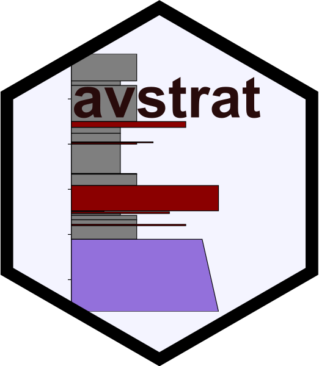
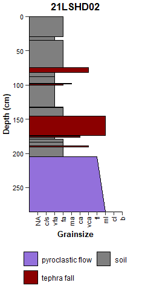
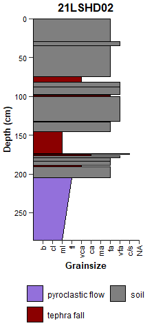
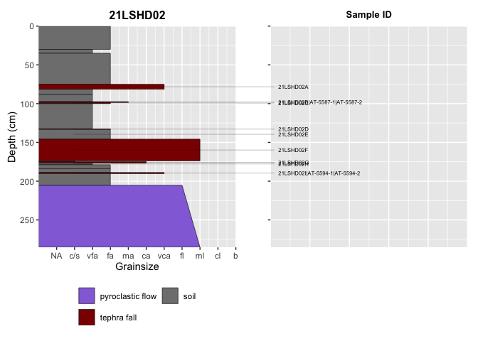

<!-- README.md is generated from README.Rmd. Please edit that file -->

# avstrat 

Tools for Generating Stratigraphic Sections

This package provides tools for data processing and generating
stratigraphic sections for volcanic deposits and tephrastratigraphy.
Package was developed for studies on Alaska volcanoes (“av”) where
stratigraphic (“strat”) figures are needed for interpreting eruptive
histories, but the methods are applicable to any sediment stratigraphy
project. The primary outputs are ggplot figures of stratigraphic
sections–`ggstrat()`, `ggstrat_column()`, `ggstrat_sampleID()`-but the
data processing logic `add_depths()` and `add_layer_widths()` enable
motivated users to create custom visualizations. Various load_data
functions facilitate ingesting from stratigraphic layer data templates.

## Installation

You can install avstrat from CRAN or from a downloaded source file off
the GitLab approved repository (Code - Download source code - tar.gz).
For option 2, you’ll need to download the source repo as a tar.gz and
map the path to the location on your computer (replace “path/to” with
the file path on your local computer where you save the download).

``` r
{r eval=FALSE}
# Option 1: Install from CRAN:
install.packages("avstrat")

# Option 2: Install from source file:
install.packages("path/to/avstrat_0.0.0.9000.tar.gz", repos = NULL, type = "source")
```

To install the development version, use the ‘devtools’ package.

``` r
devtools::install_gitlab("vsc/tephra/tools/avstrat", 
                        host = "code.usgs.gov", 
                        build_vignettes = TRUE)
```

You can also install the development version from a mirrored repo on
Github.

``` r
devtools::install_github(
  "https://github.com/mwloewen/avstrat",
  build_vignettes = TRUE
)
```

## Example

To upload data from GeoDIVA submission templates (Stations-Samples and
Layers), you will need to have two excel files that match GeoDIVA upload
templates. Examples can be found in this repo under
`inst/extdata/example_layers_upload_2024.xlsx` and
`inst/extdata/example_samples_stations_upload_2024.xlsx`. In the code
chunk below, replace “path_layers.xlsx” with the file path and file name
of your files.

``` r
library(readxl)
library(avstrat)

data_strat <- load_geodiva_forms(
   station_sample_upload = 
     readxl::read_excel("path/to/samples_stations_upload.xlsx", sheet = "Data"),
   layer_upload = 
     readxl::read_excel("path/to/layers_upload.xlsx", sheet = "Data")
 )
```

The GeoDIVA templates have some idiosyncrasies unique to Alaska Volcano
Observatory projects and database history. Most people may find a more
generic upload template more useful, and there is an upload function for
that too! See `inst/extdata/example_inputs.xlsx`, which includes data
tabs broken down into different data types: stations, sections, layers,
and samples. These can be partially merged (e.g., “stations_sections”)
or separate. Samples can be linked to layers as a nested list (similar
to the GeoDIVA layer upload, “layers-sample”) or each sample linked to a
single layer (“samples_layer”). Using the later option:

``` r
data_strat <- load_stratdata_indiv(
  stations_upload = readxl::read_xlsx("path/to/example_inputs.xlsx", 
                                      sheet = "stations"),
  sections_upload = readxl::read_xlsx("path/to/example_inputs.xlsx", 
                                      sheet = "sections"),
  layers_upload = readxl::read_xlsx("path/to/example_inputs.xlsx", 
                                      sheet = "layers"),
  samples_upload = readxl::read_xlsx("path/to/example_inputs.xlsx", 
                                      sheet = "samples_layer"),
)
```

Once you have the data in your environment, you can make a basic
stratigraphic plot and use the avstrat theme:

``` r
library(ggplot2)
#> Warning: package 'ggplot2' was built under R version 4.4.3
library(readxl)
#> Warning: package 'readxl' was built under R version 4.4.3
library(avstrat)
# Load data (this is a pre-loaded example dataset that is part of avstrat)
data_strat <- example_data_strat

# Set theme
theme_set(theme_avstrat())

# Produce a strat section
ggstrat(df = data_strat, section_name = '21LSHD02')
```



The default `ggstrat()` plot emphasizes coarser grained deposits as
larger bars, useful for recognizing significant tephra deposits. Many
prefer stratigraphic profiles to reflect the erosional profile of an
outcrop. This would be best achieved by recording a “erodability” metric
in the field, but a rough version of this is to plot the fine-grained
layers as thicker than coarse grained layers, as these typically are
less prone to erosion.

``` r
ggstrat(df = data_strat, section_name = '21LSHD02', grainsize_direction = "decreasing")
```



You can also plot sample identification along side the section. and
combine them with the patchwork package.

``` r
library(patchwork)
#> Warning: package 'patchwork' was built under R version 4.4.3
p1 <- ggstrat(df = data_strat, section_name = '21LSHD02')
p2 <- ggstrat_label(df = data_strat, section_name = '21LSHD02')

p1 + p2
#> Warning in grid.Call.graphics(C_text, as.graphicsAnnot(x$label), x$x, x$y, :
#> font family not found in Windows font database
```



More examples and demonstration of how to create your own custom plots
will be provided \[eventually\] in vignettes! Currently, a more detailed
workflow can be accessed with the installed package at:

``` r
vignette("avstrat-workflow-examples", package = "avstrat")
```

## Contributing

If find problems with this package or have features you’d like to see,
please open an issue or consider contributing yourself, I would love to
have more contributors to the package!
